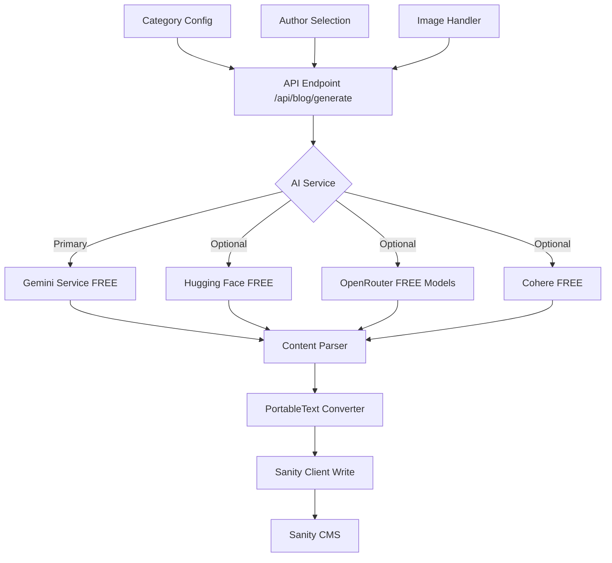

# AI Blog Content Generation System

## Overview

This plan implements an automated content generation system that creates blog posts in Sanity CMS using **free AI APIs** (primarily Gemini, with optional free alternatives) based on categories. The system will generate complete blog posts with titles, excerpts, body content, and metadata, then save them to Sanity.

## Free API Options

### Primary: Google Gemini API (FREE)

- **Free Tier**: Generous quotas for development and non-commercial use
- **Rate Limits**: 15 requests per minute (RPM) for free tier
- **Already Integrated**: You already have `@google/genai` package installed
- **Best Choice**: Recommended as primary option since it's already set up

### Alternative Free Options:

1. **Hugging Face Inference API** (FREE)

- Free tier with basic usage limits
- Access to thousands of open-source models
- Can self-host if limits exceeded

2. **OpenRouter** (FREE models available)

- Universal API layer
- Some models are free or offer daily credits
- Access to GPT-4, Claude, Mistral, Llama 3 (some free)

3. **Cohere API** (FREE tier)

- Free plan for NLP tasks
- Good for text generation and classification

### Not Free:

- **OpenAI GPT API**: No longer offers free tier (requires paid credits)
- **Perplexity API**: Paid service only

## Architecture




## Implementation Details

### 1. AI Service Abstraction Layer

**File**: `services/aiContentService.ts`

- Create a unified interface for AI content generation
- Support multiple **free** providers (Gemini primary, Hugging Face, OpenRouter, Cohere as alternatives)
- Generate structured blog content (title, excerpt, body, tags)
- Handle provider-specific API calls and error handling
- Implement rate limiting for free tier compliance
- Fallback mechanism: if one service fails/hits limits, try next free service

### 2. Content Generation API Endpoint

**File**: `app/api/blog/generate/route.ts`

- Accept POST requests with parameters:
- `category`: Target category for content
- `topic`: Optional specific topic within category
- `aiProvider`: Which AI service to use (default: gemini)
- `authorId`: Sanity author ID to assign
- `publishStatus`: 'draft' or 'published' (default: 'draft')
- Generate content using AI service
- Convert to Sanity PortableText format
- Save to Sanity CMS
- Return generated post ID and status

### 3. PortableText Converter

**File**: `lib/sanity/portableTextConverter.ts`

- Convert AI-generated markdown/HTML to Sanity's PortableText format
- Handle headings, paragraphs, lists, links, bold, italic
- Support code blocks if needed
- Generate proper block structure for Sanity

### 4. Category Configuration

**File**: `lib/content/categoryConfig.ts`

- Define category-specific prompts and guidelines
- Map categories to content themes and topics
- Store category metadata (description, target audience, tone)

### 5. Sanity Write Client

**File**: `lib/sanity/writeClient.ts`

- Create authenticated Sanity client with write permissions
- Add environment variable for Sanity write token
- Implement functions to create posts in Sanity
- Handle image uploads if needed

### 6. Image Handling

**File**: `lib/content/imageHandler.ts`

- Generate or fetch images for blog posts
- Options: Unsplash API, placeholder images, or AI-generated images
- Upload images to Sanity asset system
- Return Sanity image reference

### 7. Enhanced Gemini Service

**File**: `services/geminiService.ts` (update existing)

- Add blog content generation method
- Use structured output for consistent formatting
- Implement category-specific prompts

### 8. Hugging Face Service (Optional Free Alternative)

**File**: `services/huggingFaceService.ts`

- Implement Hugging Face Inference API integration
- Use free open-source models (e.g., Mistral, Llama)
- Match interface with Gemini service
- Handle rate limits and error responses

### 9. OpenRouter Service (Optional Free Alternative)

**File**: `services/openRouterService.ts`

- Implement OpenRouter API integration
- Access free models (Llama 3, Mistral, etc.)
- Universal API for multiple model providers
- Format responses for blog content

## Environment Variables

Add to `.env.local`:

```javascript
# Required for Sanity writes
SANITY_WRITE_TOKEN=your_sanity_write_token

# Gemini API (FREE - already have API_KEY from existing setup)
API_KEY=your_gemini_api_key

# Optional: Free alternatives
HUGGING_FACE_API_KEY=your_hf_token (optional, for Hugging Face)
OPENROUTER_API_KEY=your_openrouter_key (optional, for OpenRouter free models)
COHERE_API_KEY=your_cohere_key (optional, for Cohere free tier)

# Optional: For images
UNSPLASH_ACCESS_KEY=your_unsplash_key (optional, free tier available)
```

**Note**: Gemini API is the recommended primary option since you already have it integrated. Other services are optional free alternatives.

## Category-Based Generation

The system will use category-specific prompts to generate relevant content:

- **Sovereign AI**: Focus on digital sovereignty, AI governance, national AI strategies
- **LMS Scaling**: Learning management systems, education technology, scalability
- **Product Design**: UX/UI design, product development, user experience

## Content Structure

Generated posts will include:

- Title (AI-generated, category-relevant)
- Slug (auto-generated from title)
- Excerpt (200 chars max, AI-generated)
- Body (PortableText format, 800-2000 words)
- Category (from input)
- Tags (AI-generated, category-relevant)
- Read time (calculated from word count)
- Author (from input or default)
- Main image (generated/fetched)
- Published date (current or scheduled)

## Error Handling

- Validate category exists
- Handle AI API failures gracefully
- Retry logic for transient failures
- Logging for debugging
- Return meaningful error messages

## Security

- Protect API endpoint with authentication (optional)
- Validate inputs
- Sanitize AI-generated content
- Rate limiting for API calls

## Testing Strategy

- Test with Gemini API (primary, free)
- Test with optional free alternatives (Hugging Face, OpenRouter)
- Verify PortableText conversion
- Test Sanity write operations